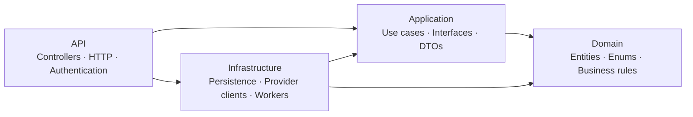

<div align="center">

  

  <h1>InboxAgent</h1>

  <p>An AI assistant for your inbox — read, understand, and prepare replies.</p>
  <p><strong>AI drafts. You decide what gets sent.</strong></p>

  
  
  
  

</div>

---

## Overview

InboxAgent is a personal project that brings AI assistance directly to email. Connect a mailbox, sync messages, and get summaries, classifications, and reply drafts based on conversation history.

The project focuses on building the backend with C# and Clean Architecture. The current version integrates Gmail and Gemini.

## Features

| Area | Implemented features |
| --- | --- |
| Accounts | Registration, email confirmation, login, password reset, and session management |
| Gmail connection | OAuth 2.0 with PKCE, read/send permissions, and mailbox disconnection |
| Email synchronization | The 100 most recent Inbox messages on initial sync; incremental updates through Gmail History |
| AI analysis | Vietnamese summaries, email classification, and priority assessment |
| Reply drafting | Conversation context from Gmail, AI-generated drafts, and manual editing |
| Send approval | Approval of the exact draft version, with send status and history tracking |

**Workflow:** Connect Gmail → Sync Inbox → Analyze email → Generate a draft → Review and edit → Approve sending.

## Architecture

The solution contains four projects. Domain and Application hold business rules and use cases. Infrastructure implements persistence and external integrations through interfaces defined in Application.



Arrows represent project dependencies. The API registers implementations through dependency injection; Application accesses them through interfaces.

```text
Project_AI/
├── Project_AI/                  # ASP.NET Core API
├── Project_AI.Application/      # Use cases, interfaces, and DTOs
├── Project_AI.Domain/           # Entities and business rules
├── Project_AI.Infrastructure/   # EF Core, repositories, and service integrations
├── assets/images/               # README images
├── scripts/                     # Local environment setup utilities
├── docker-compose.yml           # API, PostgreSQL, and Redis
└── Project_AI.slnx
```

## Tech Stack

| Component | Technology |
| --- | --- |
| API | C# · ASP.NET Core 10 · OpenAPI |
| Persistence | Entity Framework Core · PostgreSQL 17 |
| Authentication | ASP.NET Core Identity · JWT · Refresh token rotation |
| Cache and token revocation | Redis 7.4 |
| Integrations | Gmail API · Google OAuth 2.0 · Gemini API · SendGrid |
| Runtime environment | Docker · Docker Compose |

## Design Highlights

- **User ownership checks:** mailbox, email, and draft access is verified by the backend.
- **Credential protection:** Gmail tokens are encrypted, refresh tokens are stored as hashes, and authentication uses HttpOnly cookies and Redis-backed JWT revocation.
- **Bounded AI responsibility:** Gemini generates draft content; the backend derives the recipient and subject from the original email.
- **Versioned approval:** draft edits or source changes invalidate previous approval requests.
- **Send outcome tracking:** timeouts or connection failures with an uncertain result block another send attempt to reduce duplicate delivery risk.
- **Consistent errors:** Problem Details responses include application error codes without exposing internal exception details.

## Project Status

The backend implements the workflow from Gmail connection to approved sending. Google and Gemini integrations have been tested with simulated responses alongside real PostgreSQL and Redis instances; end-to-end validation with real accounts is still pending. The project is under active development and does not yet include a web frontend.

Replies currently support one recipient and plain text, without reply-all, CC/BCC, or attachments. Drafts are stored in InboxAgent's database. Uncertain send outcomes require checking Gmail Sent; there is no automatic recovery API yet. AI runs on request, and email content used for analysis or drafting is sent to Gemini.

## Local Development

<details>
<summary>Quick setup with Docker</summary>

Requires Docker Desktop running Linux containers. From the solution directory:

```powershell
Copy-Item .env.example .env
# Set POSTGRES_PASSWORD, REDIS_PASSWORD, and JWT_SIGNING_KEY in .env.
# JWT_SIGNING_KEY must be a base64 value containing at least 32 random bytes.
docker compose up -d --build
```

The API defaults to `http://localhost:8080`. Database/cache readiness is available at `/health/ready`; OpenAPI is available at `/openapi/v1.json` in Development.

Gmail, Gemini, and SendGrid must be enabled and configured separately in `.env`. Login requires a confirmed email address, so configure SendGrid to try the full registration flow. Configuration variables are listed in `.env.example`, and [Project_AI.http](Project_AI/Project_AI.http) contains example requests. Keep `.env` and User Secrets out of Git.

</details>

## Contributing

Feature suggestions, architecture feedback, and bug reports are welcome through Issues or Pull Requests. For larger changes, describe the problem and scope first. Keep each change focused to make review easier.
