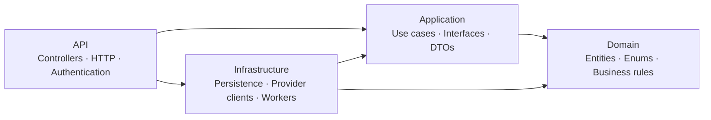

<div align="center">

  

  <h1>InboxAgent</h1>

  <p>Trợ lý AI cho hộp thư của bạn — đọc, hiểu và chuẩn bị phản hồi.</p>
  <p><strong>AI soạn nháp. Bạn quyết định gửi.</strong></p>

  
  
  
  

</div>

---

## Giới thiệu

InboxAgent là dự án cá nhân xây dựng trợ lý làm việc trực tiếp với email. Thay vì sao chép từng email vào một cuộc trò chuyện AI, người dùng kết nối hộp thư, đồng bộ email và nhận bản tóm tắt, phân loại cùng nháp trả lời dựa trên lịch sử trao đổi.

Dự án ưu tiên hoàn thiện backend bằng C# và Clean Architecture. Phiên bản hiện tại hỗ trợ Gmail và Gemini; frontend, quản lý công việc, lịch và Outlook nằm trong roadmap.

## Tính năng

| Nhóm | Đã triển khai |
| --- | --- |
| Tài khoản | Đăng ký, xác nhận email, đăng nhập, đặt lại mật khẩu và quản lý phiên |
| Kết nối Gmail | OAuth 2.0 với PKCE, cấp quyền đọc/gửi và ngắt kết nối hộp thư |
| Đồng bộ email | Lấy 100 email Inbox gần nhất ở lần đầu; cập nhật tăng dần qua Gmail History |
| Phân tích bằng AI | Tóm tắt tiếng Việt, phân loại email và đánh giá mức độ ưu tiên |
| Soạn nháp | Đọc hội thoại Gmail, tạo nháp theo ngữ cảnh và cho phép sửa nội dung |
| Duyệt gửi | Người dùng duyệt đúng phiên bản nháp trước khi gửi; lưu trạng thái và lịch sử gửi |

**Luồng chính:** Kết nối Gmail → Đồng bộ Inbox → Phân tích email → Tạo nháp → Xem và sửa → Duyệt gửi.

## Kiến trúc

Solution gồm bốn project. Logic nghiệp vụ nằm ở Domain và Application; database và các nhà cung cấp bên ngoài được triển khai trong Infrastructure thông qua interface của Application.



Các mũi tên biểu diễn phụ thuộc giữa project. API đăng ký các implementation qua dependency injection; Application gọi chúng thông qua interface.

```text
Project_AI/
├── Project_AI/                  # ASP.NET Core API
├── Project_AI.Application/      # Use cases, interfaces và DTOs
├── Project_AI.Domain/           # Entities và quy tắc nghiệp vụ
├── Project_AI.Infrastructure/   # EF Core, repositories và tích hợp dịch vụ
├── assets/images/               # Hình ảnh cho README
├── scripts/                     # Công cụ thiết lập môi trường local
├── docker-compose.yml           # API, PostgreSQL và Redis
└── Project_AI.slnx
```

## Công nghệ

| Thành phần | Công nghệ |
| --- | --- |
| API | C# · ASP.NET Core 10 · OpenAPI |
| Dữ liệu | Entity Framework Core · PostgreSQL 17 |
| Xác thực | ASP.NET Core Identity · JWT · Refresh token rotation |
| Cache và thu hồi token | Redis 7.4 |
| Tích hợp | Gmail API · Google OAuth 2.0 · Gemini API · SendGrid |
| Môi trường chạy | Docker · Docker Compose |

## Những điểm thiết kế chính

- **Quyền truy cập theo người dùng:** kiểm tra quyền sở hữu hộp thư, email và nháp ở backend.
- **Bảo vệ thông tin xác thực:** mã hóa token Gmail; lưu hash refresh token; dùng HttpOnly cookie và Redis để thu hồi JWT.
- **AI có phạm vi rõ ràng:** Gemini tạo nội dung nháp; backend xác định người nhận và tiêu đề từ email gốc.
- **Duyệt theo phiên bản:** sửa nháp hoặc thay đổi nội dung nguồn khiến yêu cầu duyệt cũ không còn hợp lệ.
- **Theo dõi kết quả gửi:** nếu Gmail chưa xác nhận kết quả do timeout hoặc mất kết nối, nháp bị khóa gửi lại để tránh gửi trùng.
- **Xử lý lỗi thống nhất:** trả Problem Details cùng mã lỗi ứng dụng, không trả chi tiết exception nội bộ.

## Roadmap

- [x] Nền tảng tài khoản, xác thực và môi trường Docker
- [x] Kết nối Gmail bằng OAuth
- [x] Đồng bộ và đọc email
- [x] Phân loại, tóm tắt bằng Gemini
- [x] Soạn nháp, chỉnh sửa và duyệt gửi Gmail
- [ ] Trích xuất công việc từ email và quản lý task
- [ ] Agent gọi công cụ trong phạm vi quyền đã cấp
- [ ] Tích hợp Google Calendar và duyệt tạo lịch
- [ ] Hỗ trợ Outlook
- [ ] Xây dựng giao diện web
- [ ] Hoàn thiện giám sát và quy trình triển khai

## Trạng thái hiện tại

Backend đã có code cho luồng từ kết nối Gmail đến duyệt gửi. Các tích hợp Google/Gemini đã được kiểm thử bằng phản hồi giả lập cùng PostgreSQL và Redis thật; vẫn cần nghiệm thu toàn bộ luồng với tài khoản thật. Dự án đang phát triển và chưa có giao diện web.

Hiện nháp hỗ trợ trả lời một người nhận bằng plain text; chưa có reply-all, CC/BCC hoặc tệp đính kèm. Nháp được lưu trong database của InboxAgent. Trường hợp gửi chưa rõ kết quả cần đối chiếu Gmail Sent; chưa có API tự khôi phục. AI chỉ chạy khi được yêu cầu, và nội dung email dùng để phân tích hoặc soạn nháp được gửi đến Gemini.

## Phát triển local

<details>
<summary>Thiết lập nhanh với Docker</summary>

Cần Docker Desktop chạy Linux containers. Tại thư mục solution:

```powershell
Copy-Item .env.example .env
# Điền POSTGRES_PASSWORD, REDIS_PASSWORD và JWT_SIGNING_KEY trong .env.
# JWT_SIGNING_KEY cần giá trị base64 chứa ít nhất 32 byte ngẫu nhiên.
docker compose up -d --build
```

API mặc định: `http://localhost:8080`. Kiểm tra kết nối database/cache tại `/health/ready`; OpenAPI có tại `/openapi/v1.json` trong Development.

Gmail, Gemini và SendGrid cần được bật và cấu hình riêng trong `.env`. Đăng nhập yêu cầu email đã xác nhận; cần cấu hình SendGrid để thử luồng đăng ký đầy đủ. `.env.example` chứa tên các biến cấu hình, và [Project_AI.http](Project_AI/Project_AI.http) có ví dụ request. `.env` và User Secrets không được đưa vào Git.

</details>

## Đóng góp

Góp ý về tính năng, kiến trúc và lỗi qua Issues hoặc Pull Requests. Với thay đổi lớn, hãy mô tả vấn đề và phạm vi trước; mỗi thay đổi nên tập trung vào một phần để dễ đọc và review.
